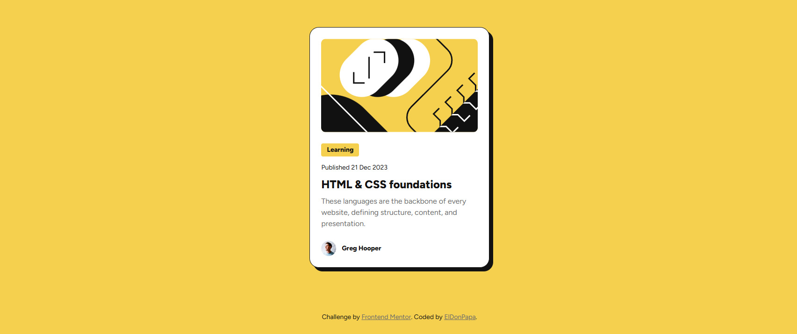

# Frontend Mentor - Blog preview card solution

This is a solution to the [Blog preview card challenge on Frontend Mentor](https://www.frontendmentor.io/challenges/blog-preview-card-ckPaj01IcS). Frontend Mentor challenges help you improve your coding skills by building realistic projects. 

## Table of contents

- [Overview](#overview)
  - [The challenge](#the-challenge)
  - [Screenshot](#screenshot)
  - [Links](#links)
- [My process](#my-process)
  - [Built with](#built-with)
- [Author](#author)

## Overview

### The challenge

Users should be able to:

- See hover and focus states for all interactive elements on the page

### Screenshot

### Links

- Solution URL: [frontendmentor.io/solutions/simple-solution-using-bem-and-semantic-html-GmQR8s-PuU](https://www.frontendmentor.io/solutions/simple-solution-using-bem-and-semantic-html-GmQR8s-PuU)
- Live Site URL: [fm-blog-card-omega.vercel.app/](https://fm-blog-card-omega.vercel.app/)

## My process

### Built with

- Semantic HTML5 markup
- CSS relative units
- [BEM naming convention](https://en.bem.info/methodology/naming-convention/)- A way to organize CSS in your project
- Flexbox
- Desktop-first workflow
- [ViteJS](https://vitejs.fr/) - Build tool
## Author

- Frontend Mentor - [@ElDonPapa](https://www.frontendmentor.io/profile/ElDonPapa)
